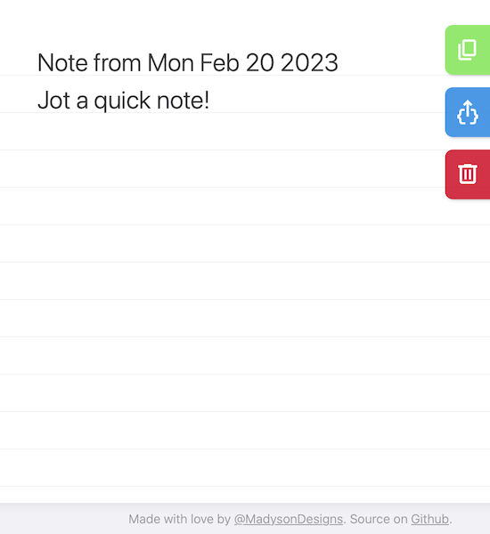

# QuickNote

A simple text field in a self-contained HTML page that's quicker than a Post-it note. I typically live in the browser, which makes it the most efficient tool to capture what's on my mind.

## Setting up QuickNote

Copy the HTML file wherever you want it. Locally, on your server, wherever. It's just the one file. #simplicity

You can open Quicknote even faster by:
- **Option A:** Setting it as your browser's new tab page
- **Option B:** Bookmarking it (Optional: add a custom keyboard shortcut)
- **Option C:** Adding a [site search shortcut](https://support.google.com/chrome/answer/95426) (Chrome-based browsers only)

## Using QuickNote

**Whenever you need to jot something down, open QuickNote and just start typing.**

The first line automatically populates with a header including the date the note was created. LocalStorage saves your note in case you accidentally refresh, close the tab, or your browser crashes.

Use the Copy or Share buttons to move your note to your PKMS of choice:
- Copy drops the note title and text on your clipboard so you can paste it anywhere.
- Share converts the note to JSON and triggers the browser's native Share Sheet for more advanced sharing options.
  - The JSON object includes separate `title` and `text` fields
  - It should work with any sharing extension that can handle JSON
  - I'm a fan of Apple Shortcuts since it gives you the flexibility to do almost anything with your note – [here's an example shortcut](https://www.icloud.com/shortcuts/4a9b13aaa0d541199fe17cc064c4ba68) for inspiration!

Once you've saved your note for posterity, use the Clear button to create a new blank note!

## About QuickNote

Basic text input and editing should look and work fairly consistent on any browser or platform.

Full functionality assumes you're using a modern browser that supports current web best practices ([Storage](https://developer.mozilla.org/en-US/docs/Web/API/Storage_API#browser_compatibility), [Clipboard](https://developer.mozilla.org/en-US/docs/Web/API/Clipboard_API#browser_compatibility) and [Web Share](https://developer.mozilla.org/en-US/docs/Web/API/Web_Share_API#browser_compatibility)). Sorry [IE](https://img.buzzfeed.com/buzzfeed-static/static/2019-07/24/10/asset/d281f80a1f45/anigif_sub-buzz-2733-1563964464-1.gif), you're out of luck.

If you're using a browser/device that's less than a couple years old, Quicknote should work just fine, except:
- Share does not work in Chrome-based browsers on MacOS – Use Safari
- These APIs are only available in [secure contexts](https://developer.mozilla.org/en-US/docs/Web/Security/Secure_Contexts) – over HTTPS or from local resources

**#itscomplicated: Cross-platform favicons**

Surprisingly, there is still no (simple) canonical way to approach favicons in 2023.

QuickNote's `<link rel="icon">` tag uses an embedded SVG that works for most browsers without an additional HTTP request. I've also included the favicon in a couple other formats to support wacky caveats (ahem, Safari):
- Safari does not support SVG favicons at all (wat.) – Your options are to drop the included `favicon.ico` file in your site root (no link tag needed) or to include a second link for PNG format:

    `<link rel="icon" type="image/png" sizes="any" href="/favicon.png">`
- Safari uses a separate icon for pinned tabs – you can add another link to support this:

    `<link rel="mask-icon" href="/safaricon.svg" color="#207EDF">`
- Old and niche browsers are a mixed bag – `favicon.ico` in your site root will probably work for many of these in addition to Safari, but YMMV
- Pretty home screen icons on mobile devices require about a dozen extra files, a manifest, and a bunch more requests – this isn't a relevant use case for me so I didn't include these

If you'd like to support more [scenarios](https://dev.to/masakudamatsu/favicon-nightmare-how-to-maintain-sanity-3al7), feel free to use the included images to [generate](https://realfavicongenerator.net/) more versions.

## Usage & feedback

Feel free to use or modify QuickNote as you see fit (GPL).

Finding QuickNote useful? Have a questions or suggestion? Let me know with an [issue](https://github.com/madysondesigns/quicknote/issues)!
